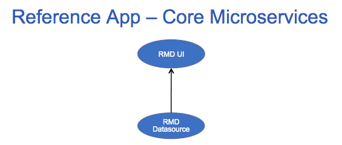
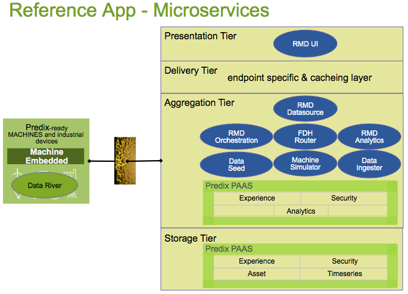
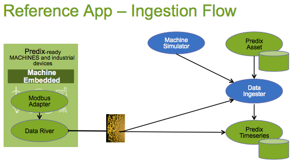
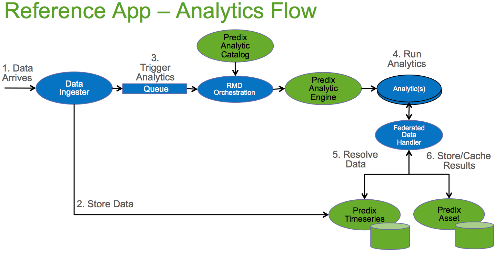
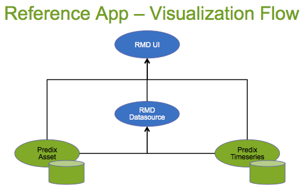

Predix RMD Reference App
=====================

Welcome to the Predix Remote Monitoring & Diagnostics (RMD) Reference Application.  You can view a running version of the  [Reference App](https://rmd-ref-app.run.aws-usw02-pr.ice.predix.io/dashboard) in your browser using these login credentials

        User: rmd_user_1
        Password: RMD_user_1
        
You can view our <a href=https://youtu.be/2MGPTJ8yjyc target="_blank">Video</a> and later run the [deployment script](#to-download-and-push-reference-app) which will push the Reference App to your own Cloud Foundry space so you can quickly start trying out various Predix Services.

Now, take a few moments to learn all about  Predix, using Reference App as a guide.  There is lots to discover and soon you'll be creating Predix Apps of your own.

##Predix Integration
The Reference App Front-End and Back-End Microservices demonstrate how to use the Predix PAAS to build an Industrial Internet application.  The app takes advantage of the following Predix components:

- [Predix Dashboard UI Seed](https://github.com/predixdev/predix-seed)
- [Predix Security](https://www.predix.io/docs#Jig2gorb)
- [Predix Asset](https://www.predix.io/docs#zChUPu1U)
- [Predix Timeseries](https://www.predix.io/docs#mnlfuvZz)
- [Predix Analytics](https://www.predix.io/docs#EG3xVdLg)
- [Predix Machine](https://www.predix.io/docs#mL2j0aax)
- [Predix Machine Modbus Adapter](https://www.predix.io/docs/?r=402244#wjGUrd7M)
- [Predix Data River Receiver](https://www.predix.io/docs/?r=829105#s8wRgtg6)

##RMD Reference App
RMD Reference App is composable and the pieces can be used in a variety of configurations to help solve your Application use-case.  Like most Apps, at it's core, Reference App consists of a [RMD UI](#microservices) front end microservice and a [RMD Datasource](#microservices) back-end microservice.   



Beyond the core services there are other [microservices](#microservices) and [microcomponent utilities](#microcomponents) which help generate Data, make Secure Rest calls or integrate with all the different Predix Services and Security.

##Predix Hello World
If you'd like to get a feel for a Predix Cloud Foundry microservice, try our Hello World microservice which also helps ensure your account and network access are set up in a simpler app.  [Predix Microservice Templates](https://github.com/PredixDev/predix-microservice-templates#predix-microservice-templates) is a helpful back-end Microservice Seed template which you'll likely use as a starting point to create your own Predix Microservice in the Cloud.

##Detailed Architecture

Architecturally the reference app is organized into four Tiers (Presentation, Delivery, Aggregation and Storage) and supports three Data Flows (Ingestion, Analytics, Visualization)
- Presentation Tier - UI layer and microservices
- Delivery Tier - Cacheing, Mobile, Personalization
- Aggregation Tier - Service Composition and Business Logic
- Storage Tier - the Predix PAAS Services


The 8 microservices are pushed to and run in cloud foundry, as follows:



###Ingestion Flow
Data Flows in two ways. Either from the MachineDataSimulator to the Timeseries Ingester which looks up the Asset Meter meta-data providing info needed to post data to the Predix Timeseries service. Or from the Predix Machine DataRiver which posts data over a websocket to the Timeseries service directly.  The Timeseries Ingester is also notified via a websocket which allows for a Live websocket feed to the RMD UI and also provides a trigger point for Analytics.

(future) Raw data often needs cleaning and preparation before it is consumable via Analytics and UI.  A best-practice would be to mark this data as raw and trigger Cleansing and Quality jobs leveraging the analytics framework.  



###Analytics Flow
Data arrives via the Ingestion Flow and is stored.  A message is placed in a queue which kicks off an Analytic Orchestration.  The Analytics uses data from Predix Asset and Predix Timeseries, produces a result, which is then stored back to Predix Asset or Predix Timeseries or potentially to/from any other datastore.



###Visualization Flow
The UI accesses data from Predix Asset directly which drives the Asset selector menu. Once a selection is made the View requests data from the RMD Datasource and returns the data from Predix Asset and Predix Timeseries in a mashup.  However, in the Graph Widget the Timeseries service is accessed directly. 



##Getting Acquainted with Reference App
We have a <a href=https://youtu.be/2MGPTJ8yjyc target="_blank">Video</a> to provide an overview of the RMD Reference App.

The RMD Reference App is comprehensive and there is lots of info to consume.  If you prefer to learn in smaller chunks, Ref App uses components internally which are considered standalone and each piece can be used separately in your own application.

1. Try the [Dashboard Seed](https://github.com/PredixDev/predix-seed) for a introductory look at a Front End Microservice.

1. Try [Predix Microservice Template](https://github.com/PredixDev/predix-microservice-templates) Hello World for a back-end Microservice Seed template.  Every RefApp back-end microservice is based on this.

1. Take a detailed tour of each [Reference App Microservice](#microservices), read the docs, run the unit tests, visit the property files and read the Java Docs. 

1. View the [Asset Model](#asset-model)

1. Look at [Predix Microcomponent Bootstraps](docs/microcomponents.md) - reusable libraries that can be used in any microservice

##To Download and Push Reference App
1. Download a [DevBox](https://www.predix.io/catalog/other-resources/devbox.html) and launch it in Virtual Box or install the [Dependencies](#dependencies)

1. [Prepare your environment](#preparation) then Download and Push to your own Cloud Foundry Space in 5 easy steps

1. Clone the github repository to your machine
  
	  ``` 
	  git clone https://github.com/PredixDev/predix-rmd-ref-app.git
	  cd predix-rmd-ref-app
	  ```
1. Run the Install Script. (You will be asked to login to cloud foundry, if you haven't already done so.)

  ``` 
  python scripts/installRefApp.py 
  ```
  Note: The install script pulls the submodules and packages all the projects and deploys to Predix Cloud Foundry 
  
1. Launch the RefApp, login and visit the Bentley Compressor and Refinery screens.  (The RefApp works best in the Chrome browser.) 
  ```
  https://rmd-ref-app-ui-(yourlogin).run.aws-usw02-pr.ice.predix.io/dashboard 
  ```
  
1. Optional - Setup the Data Model and Data.  This step is already done by the install script, but you can also run this step manually to set up your asset model.

    One of the microservices pushed to the cloud is the Data-Seed-Service, open it in a browser
    ```
    https://data-seed-(yourlogin).run.aws-usw02-pr.ice.predix.io
    ```
    Enter the user and pass for Reference App: 
    ```
    rmd_user_1 / RMD_user_1
    ```
    Browse for the 
    ```
    PredixApps/dataseed-service/src/main/resources/rmdapp/AssetData.xls and submit
    ```
1. Optional - Launch the MachineSimulator which is a microservice that pushes some Timeseries Data to the Predix Timeseries datastore.  This step is already done by the install script, but you can start the simulator any time to add more data to time series, or to see live stream data.

    ```
    cf start machinedata_simulator_(yourlogin)
    ```

[Pulling Submodules and Manual Steps](docs/submodules.md) - A lot goes in to Cloning, Building, Securing and Pushing the RefApp. Visit this page to see a more detailed look at each command.

###Dependencies

|Cloud Dependencies | | | |
| ------------- | :----- | :-----|  :-----|
| Predix UAA      | Predix Timeseries | Predix Analytic Runtime | New Relic (optional) |
| Predix ACS      | Predix Asset      | Rabbit MQ |  Redis |

|Supported | Note |
| ------------- | :----- |
| [DevBox](https://www.predix.io/catalog/other-resources/devbox.html)      | all the Required Tools pre-installed and configured |
| Chrome      |  |
| Firefox      | |
| [Eclipse STS](https://spring.io/tools/sts/all)            | |

|Required - latest unless specified | Note |
| ------------- | :----- |
| Java 8 | |
| GitHub Acct | logged in |
| Git | |
| Maven | https://artifactory.predix.io/artifactory/PREDIX-EXT |
| Node | |
| Bower | |
| Grunt | |
| CloudFoundry ClI 6.12.2 |  https://github.com/cloudfoundry/cli/tree/v6.12.2#downloads.  There is bug on this page, so you have to manually get the URL and the add "&version=6.12.2".  For example for Windows32 it would look like this...https://cli.run.pivotal.io/stable?release=windows32&source=github&version=6.12.2 |
| Python 2.x |  |
| Windows : cgywin |  |

##Preparation
Reference App accesses code repos at https://github.com/PredixDev and a maven repository at https://artifactory.predix.io.

The best experience is to use a [DevBox](https://www.predix.io/catalog/other-resources/devbox.html) which has all the tools and settings pre-installed.  
* In DevBox,  
	* add your <a href="https://maven.apache.org/guides/mini/guide-encryption.html">encrypted</a> predix.io username and password to the /predix/.m2/<a href="https://github.com/PredixDev/predix-rmd-ref-app/blob/master/docs/settings.xml">settings.xml</a>
  ```
  replace (predix.io.username.here) with your Predix.io user and pass in settings.xml
  ```
  ```
  also ensure plugin repo id is "predix.repo" in settings.xml
  <pluginRepository>
	<id>predix.repo</id>
  ```

	* to avoid entering user/pass several times, run this command to cache it
  ```
    git config --replace-all --global credential.helper 'cache --timeout=7200'
  ```
	* OSX: To enable Copy/Paste using Left Command key.  
  ```
    On Host run this command: VBoxManage setextradata global GUI/Input/HostKeyCombination 54
    On VM: Choose System/Preference/Keyboard/Layouts/Layout Options/Alt/Win Key Behavior/Ctrl is mapped to Win Keys(and the usual Ctrl keys)
  ```
    
  >We have a second DevBox for GE employees which helps with corporate proxy settings.  

  >In your own IT environment you may need to configure the [proxy](docs/proxy.md) settings Environment variables within the VM or your own laptop.

* For non-DevBox users,  
	For users wanting to install all the tools, please reference the DevBox settings, and also ensure you have the prerequisites installed from Predix.io [Getting Started](https://www.predix.io/docs/?b=#Uva9INX3) documentation and the [RMD Reference App Dependencies](https://github.com/PredixDev/predix-rmd-ref-app#dependencies).  

	* Merge or replace this Maven <a href="https://github.com/PredixDev/predix-rmd-ref-app/blob/master/docs/settings.xml">settings.xml</a> template with your ~/.m2/settings.xml<br>
	Note: $M2_HOME/conf/settings.xml may exist and takes precedence.  It is best to remove or merge with ~/.m2/settings.xml.

	* add your <a href="https://maven.apache.org/guides/mini/guide-encryption.html">encrypted</a> predix.io username and password to the ~/.m2/<a href="https://github.com/PredixDev/predix-rmd-ref-app/blob/master/docs/settings.xml">settings.xml</a>
by replacing predixuser@ge.com with your Predix.io user and pass.

  * to avoid entering user/pass several times, run this command to cache it
  ```
  git config --replace-all --global credential.helper 'cache --timeout=7200'
  Windows: git config --global credential.helper wincred
  ```
   * Windows requires cgywin with curl installed . Download and installation instructions at https://cygwin.com/install.html .To install curl follow the cygwin package installer to search for curl and complete the installation.
   	

##Microservices
The Ref App consists of 8 microservices. Each microservice can be individually managed and scaled, leveraging the Cloud Foundry infrastructure. These services can be mixed and matched for your next Predix application depending on which services you need to integrate with.

The Default UAAconfigurationconfigured for the RMD refernce application is loacted under scripts/installConfig.py folder
 ```
 rmdAppClientId = "mvp3_ref_app"
 rmdAppSecret = "mvp3ref@pp"
 uaaAdminSecret = "rmd_uaa_secret"
  ```

###[RMD-Ref-App-UI](https://github.com/PredixDev/rmd-ref-app-ui#rmd-reference-application-ui-microservice)
An AngularJS/Web Components based UI framework.  We used the [Predix Dashboard Seed](https://github.com/PredixDev/predix-seed) as a starting point.  The UI talks to the RMD Datasource Service, Predix UAA, Predix Asset and Predix Timerseries back-end services.

###[RMD Datasource Service](https://github.com/PredixDev/rmd-datasource/blob/master/README.md#welcome-to-the-rmd-datasource-microservice)
A Mashup Service doing much of the logic for the Reference App.  It talks to Predix Asset and Timeseries databases and return results for display.

###[Data Seed Service](https://github.com/PredixDev/data-seed-service/blob/master/README.md#welcome-to-the-data-seed-service)
A service to help create sample data in Predix Asset.  Upload a spreadsheet of data and it creates Groups, Classfications, Assets and Meters in Predix Asset. 

###[Machine Data Simulator Service](https://github.com/predixdev/machinedata-simulator/tree/master#machinedata-simulator)
  A Service to generate data when a physical machine is not available.  The Simulator sends data to the Data Ingestion Service when it is up and running.

###[Data Ingestion Service](https://github.com/predixdev/dataingestion-service/tree/master#predix-data-ingestion-service)
  A Service to accept Machine data or Simulated data, look up the Asset and Meter information in Predix Asset which provides enough info to post the data to the Timeseries database.  It also acts as a websocket server streaming live Machine sensor data to the UI.

###[RMD Orchestration Service](https://github.com/predixdev/rmd-orchestration/tree/master#rmd-orchestration)
  A Service that listens for FieldChangedEvent Queue messages to trigger Predix Analytic Orchestrations.  The DataIngestion service puts these messages on the queue when data for a Field representing a Sensor arrives.  Orchestrations themselves can also place messages on the queue which can trigger more Orchestrations updating attributes up (or down) the Asset Hierarchy.

###[RMD Analytic Service](https://github.com/predixdev/rmd-analytics/tree/master#analytics-for-predix-rmd-reference-app)
  An Analytic Microservice framework that receives Orchestration requests, resolves data and computes results.  The analytics can be in the cloud, streaming analytics, against near-data datasources (hadoop, etc), or also at the edge (on Machines outside the cloud).

###[FDH Datahandler Service](https://github.com/predixdev/fdh-router-service/tree/master#fdh-router-service)
  The Federated Data Handler framework retrieves data from any Datasource using a simple Get or Put API.  The Analytic framework leverages it to retrieve data and store results. FDH can help manage data Get/Put requests that are from distributed, near-data, relational db, public internet, in a file, via other Rest APIs and also at the Edge (on Machines outside the cloud).

##Asset Model
Since Predix Asset comes with an empty database, the Reference App creates a data 'model' depicted below, which sets up entities and attributes for Groups, Classifications, Assets and Meters.

Note: Meter will change to Parameter in a future release


The model has these characteristics:
- A Turbine, for example,  is Modeled as a Classification
- (future)A Device, such as a Honeywell Controller, is modeled as a Classification
- (future)A DeviceMeter is hooked to Predix Machine and a data Node retrieves data using an Adapter.  
- An AssetMeter is hooked to Predix Machine and a data Node retrieves data using an Adapter.  
- A Predix Machine can talk to many Devices on many Industrial Machines
- A Meter represents a Timeseries Data parameter, either raw sensor data or calculated data
- (future)A DeviceAsset is an instance of a Device classification and has DeviceMeter instance attributes
- An AssetGroup can be a location (Site,Plant,etc) or an entity(Enterprise,City,County) that logically holds a set of Assets
- An Asset is an instance of a Classification and has singleValue Attributes as well as AssetMeter instance attributes
- AssetMeter knows of it's Unit of Measure and also has a key to several Datasources
DeviceMeter ID
Node ID
Timeseries Tag ID
- A Field further describes any Attribute for purposes such as DataIngestion, UI, DataBinding for FederatedQuery, Analytics
- A Field has a FieldSource that describes how or where the data is stored for an Attribute
- A Field has a DataHandler uri that knows how to retrieve or store data from/to a FieldSource
- (future)A MachineAsset can be modeled to navigate from the Machine Id to the Devices and Assets

##APIs
The reference app defines some apis and message bodies that are needed to communicate between microservices.
* [RMD Datasource](https://github.com/PredixDev/rmd-datasource)
* [Data Ingestion](https://github.com/PredixDev/dataingestion-service)
* [Run Analytic](https://github.com/PredixDev/ext-interface)
* [Federated Datahandler](https://github.com/PredixDev/ext-interface)
* [FieldChangedEvent](https://github.com/PredixDev/ext-interface)

##Microcomponents
* [Predix Microcomponent Bootstraps](docs/microcomponents.md) - reusable libraries that can be used in any microservice

####Known Issues
* Safari has visual issues
* Chrome can have blurring

### More Details
* [RMD overview](docs/overview.md) - the Remote Monitoring & Diagnostics use-case
* [Front end development notes](https://github.com/predixdev/rmd-ref-app-ui/tree/master/public/docs/frontEndDev.md) - details on front end configuration, controllers, widgets, etc.
* [How to customize a widget](https://github.ge.com/predixdev/rmd-ref-app-ui/tree/master/public/docs/customizeWidget.md) - steps to create a custom Predix dashboard widget.
* [Securing an application](docs/security.md)
* [More GE resources](docs/resources.md)

