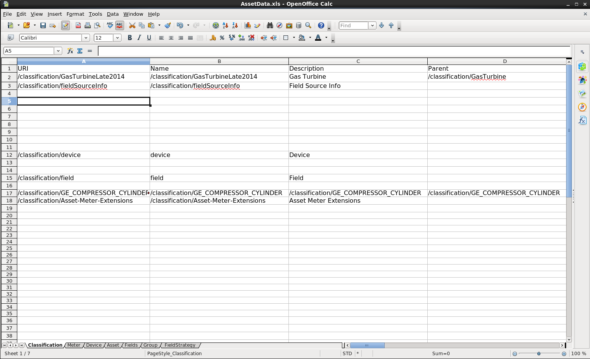

Welcome to the Data Seed Service.  It's purpose is to seed data from a Spreadsheet and post that data to Predix Asset.  This project runs as either a spring-boot app locally or in the cloud as a microservice too. 

Data Seed is gated with Predix Security and Access control . 
Use admin credentials to upload the SpreadSheet . (rmd_admin_1/RMD_admin_1) 
Setting for ACS : https://github.build.ge.com/adoption/data-seed-service/tree/develop/dataseed-service/config/acs

Data Seed currently supports importing data from 4 tabs of the Spreadsheet (other tabs are for future use-cases):
- Classification
- Meter
- Asset
- Group

Simply, edit the data in the Spreadsheet, run the DataSeed as a service and upload the file.

Download the Data-Seed service

      git clone https://github.build.ge.com/adoption/data-seed-service.git

Build it

      mvn clean install

Launch the service locally

      java -jar target/dataseed-service-0.0.1.jar
      
Look for the log entry indicating the port used.  e.g. "Tomcat started on port(s): 8184 (http)".  In a browser go to

      http://localhost:8184

Or you can push it to the cloud

      cf push 
      or
      cf push <my-data-seed-service-name>
      
Access at the appropriate cloud url, e.g.

      http://data-seed-service.grc-apps.svc.ice.ge.com/
      
###Import to Eclipse

      mvn eclipse:eclipse
      start eclipse
      File / Import / General / Existing Projects To Workspace 

##Tech Stack
- Spring
- SpringBoot
- SpringTest
- Maven

##Microcomponents
- [AssetBootstrap](https://github.com/predixdev/asset-bootstrap-client)
- [TimeseriesBootstrap](https://github.com/predixdev/timeseries-bootstrap)
- [PredixBoot](https://github.com/predix/predix-boot)
- [PredixRestClient](https://github.com/predixdev/predix-boot)
  
### More Details
* [More GE resources](http://github.com/predixdev/predix-rmd-ref-app/docs/resources.md)
* [RMD Reference App](http://github.com/predixdev/predix-rmd-ref-app)
