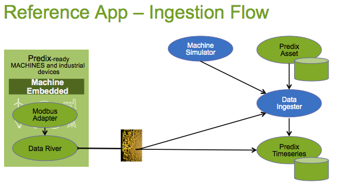

##Predix Data Ingestion Service

Welcome to the Predix Data Ingestion Service.  This service is focused on receiving a request to store Timeseries Data and sending it to the Timeseries service.  It is part of the Data Ingestion Pipeline where a lookup is performed for an AssetId, accessing metadata about each Timeseries Meter.  The metadata will hold the required info needed to post the data to the Predix Timeseries database. 

###Ingestion Flow
Data Flows from the MachineDataSimulator or a physical Asset via Predix Machine to the HTTP-DataRiverReceiver in the cloud.  The Timeseries Ingester takes over from there, looks up the Asset Meter meta-info which provides the info needed to post the data to the Predix Timeseries service. 

 

##Asset Model
This service is part of the Predix Reference App.  Since Predix Asset comes with an empty database, the Reference App creates a data 'model' depicted below, which sets up entities and attributes for Groups, Classifications, Assets and Meters.

The model has these characteristics:
- A Turbine, for example,  is Modeled as a Classification
- (future)A Device, such as a Honeywell Controller, is modeled as a Classification
- A Device is hooked to Predix Machine and a data Node retrieves data using an Adapter.  
- A Predix Machine can talk to many Devices on many Industrial Machines
- A Meter represents a Timeseries Data parameter, either raw sensor data or calculated data
- (future)A DeviceAsset is an instance of a Device classification and has DeviceMeter instance attributes
- An AssetGroup can be a location (Site,Plant,etc) or an entity(Enterprise,City,County) that logically holds a set of Assets
- An Asset is an instance of a Classification and has singleValue Attributes as well as AssetMeter instance attributes
- AssetMeter knows of it's Unit of Measure and also has a key to several Datasources
DeviceMeter ID
Node ID
Timeseries Tag ID
- (future)A Field further describes any Attribute for purposes such as DataIngestion, UI, DataBinding for FederatedQuery, Analytics
- (future)A Field has a FieldSource that describes how or where the data is stored for an Attribute
- (future)A Field has a FieldStrategy Handler uri that knows how to retrieve or store data from/to a FieldSource
- (future)A MachineAsset is be modeled to navigate from the Machine Id to the Devices and Assets

##Tech Stack
- Spring
- SpringBoot
- SpringTest
- Maven

##Microcomponents
- [AssetBootstrap](https://github.com/PredixDev/asset-bootstrap)
- [TimeseriesBootstrap](https://github.com/predixdev/timeseries-bootstrap)
- [PredixBoot](https://github.com/predixdev/predix-boot)
- [PredixRestClient](https://github.com/predixdev/predix-boot)

### More Details
* [More GE resources](https://github.com/PredixDev/predix-rmd-ref-app/blob/master/docs/resources.md)
* [RMD Reference App](http://github.com/predixdev/predix-rmd-ref-app)

### Modified for personal use --Anoop
- Changed the logic in the Handler to bypass the Asset Service.
- Added files to include the headers for Data Ingestion Websocket Push request.

### For configuration and upload follow the following steps
- In ~/.m2/settings.xml update the username and password (predix.io) to access the Predix Artifactory.
- Do a git clone of the whole REF APP.
- check dependency requirements for Timeseries-Bootstrap, Asset-Bootstrap, Predix-Rest Client & Data Ingestion project packages (pom.xml).
- Update application properties in timeseries-bootstrap, data ingetsion & asset-boostrap codes to suit your environment.
- Navigate to the Data-Ingestion folder and run mvn package, it creates a .jar file in the target foldre in the same location.
- Update manifest.yml (in Data Ingestion) to suit your environment (UAA, Asset & Views Service) setup.
- Do a cf push with relevant poroperties in the manifest yaml file.

### To check the service
- Use any REST Client and use the URL generated when you pushed the App.
- Give the Timeseries data input in the format 
-   URL/clientId=<clientId>&tenantId=<TSS-instance-id>&content=[{"sensorName":"Humidity","SensorID":"FGD1235","MaxValue":"465","MinValue":"23","SensorReadings":[{"epoch":"1456220247000","value":"4"},{"epoch":"1456381617000","value":"6"}]}]
- Above is an example any number of sensors and any number of timestamped values can be uploaded.
- Do a quesy to check if the data is uploaded.
