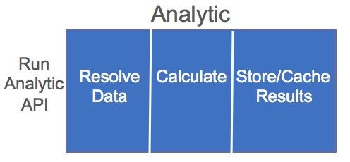

Analytics for Predix RMD Reference App
=====================
The right Analytic Interface can provide Algorithm portability and the flexibility to handle Data from any Datasource while empowering the developer to create analytics in any Language on any execution platform.  This value proposition is achieved by leveraging the techniques here with the power of the Predix platform.


The Predix Orchestration Engine invokes 2 types of Analytic microservices.  

Type 1 is a simple python, matlab or other supported script and data which is submitted to the Predix Analytic Catalog where Predix auto-wraps and deploys the script to the cloud.  

This project is a template for the 2nd type; a custom Analytic where you need control of the microservice and the contents particularly when resolving data at runtime using ClientId tokens to secure services such as PredixAsset and PredixTimeseries.

The Reference App helps you define a commmon API and lifecycle allowing the analytic to run in any language, on any operating system, against near-data, distributed data or cloud-based data sources.  The design is portable and can be taken to the edge on Predix Machine.  

##Orchestrated Analytics


The Predix orchestration engine invokes each analytic in a workflow.  The workflow can be complex with forks and joins.

##Individual Analytic Lifecycle
The Analytic resolves the data, performs the calculation and then stores or caches the data.  Data resolution and storage is managed by the [Federated Data Handler](https://github.com/PredixDev/fdh-router-service) allowing any datastore to be accessed.



The [Run Analytic API](https://github.com/PredixDev/ext-interface/blob/master/ext-interface/src/main/resources/META-INF/schemas/pm/entity/runanalytic/runanalytic.xsd) (best viewed in Eclipse STS) creates a Rest Based api that can be invoked in the cloud, for streaming analytics, against near-data analytics (map-reduce, etc), or also at the edge (on Machines outside the cloud).  

> Why XSDs?  We work with other XSD Industrial Internet based libraries.  XML is not required.  We use REST and we prefer JSON at runtime.  We like the type-safety validation and generation tools of XSD.  We like to support other languages with the same API.  We like polymorphism.  We like enumerations.  We like contracts. We like the embedded docs.     

RunAnalytic contains a simple list of InputPort and a list of OutputPort.  The input port "template" below says we want the name to be ALARM_HI and the FieldSelection is a Real number and correlation resultId should be marked with ALARM_HI.
```json
{
    "portIdentifier": {
        "@type": "PortIdentifier",
        "id": "ALARM_HI",
        "name": "ALARM_HI"
    },
    "fieldSelection": {
        "expectedDataType": "DMReal",
        "resultId": "ALARM_HI"
    }
}
```
Here is the same structure in a picture. (defined by an xsd)


Defining other ports is easy because it's just a name and an expectedDataType.  

##Data
We can define Real, Int, Boolean, String, Timeseries or any data structures that are expected for our ports. These are the most common, but any Data Type can be defined because the API support Animal, Cat, Dog polymorphic semantics.

This is a notional image just to give a quick overview of the common types of data.  The actual structures don't have a commonDataTypes wrapper.


##Analytic Template
Many Analytics are reusable, so the Template definition of Port Name, Expected DataType and Expected EngineeringUnit (celcius, fahrenheit, etc) define what the analytic wants.  The data resolved by the Analytic could be from a variety of data sources (customer specific datasources, files, hadoop, rdbms, cache, Asset, Timeseries, etc).  

>This technique of defining the Analytic Template, configuring the DataBinding and SelectionFilter where clauses and doing late data-binding at runtime allow the Analytics, and the tooling to support this, to apply to any execution runtime against any datasource.  

##DataBinding to the FieldSelection
When we assign a Field and SelectionFilter to the Port we call this Data Binding.  It simply means we are defining which Attribute from which Datasource and which Where clause to use at runtime.  Each Port for the analytic usually has different where clause semantics relative to the problem at hand.

The FieldIdentifer has an id, name, and source.  The id is a Rest principle based string indicating where to find the Real, Int, String, Bool, or Timeseries attribute within a datasource.


This Input port says to get the ALARM_HI from PREDIX_ASSET by looking up an Asset and looking for "crank-frame-dischargepressure" in the Map\<String,AssetMeter\> for the outputMaximum attribute.  

```json
{
			"portIdentifier": 
			{
				"@type": "PortIdentifier",
				"id": "ALARM_HI",
			},
			"fieldSelection": 
			{
				"fieldIdentifier": 
				{
					"@type": "FieldIdentifier",
					"id": "/asset/assetMeter/crank-frame-dischargepressure/outputMaximum",
					"source": "PREDIX_ASSET"
				},

				"expectedDataType": "DMReal",
				"resultId": "ALARM_HI"
			},
```

In the full Port definition depicted below notice the FieldSelection defines the data, the SelectionFilter allows for a where clause, the Engineering Units are defined, the portType handles some edge cases and even optional Data can be passed in  instead of resolved later.


The Selection Filter is a where clause which also has Animal, Cat, Dog polymorphic semantics.  We can define any Selection Filter we want.  We have defined 2 SelectionFilters which will take you a long way in Predix.  A TimeSelectionFilter which mirrors the Predix Timeseries API and simply 'extends' SelectionFilter.  And a FieldSelectionFilter which allows for basic AND/OR semantics similar to a where clause.    SelectionFilters can return multiple Models (like rows in a database) and thus Analytic actions can be performed on the set of data returned.


##Traversing the Model

Field definitions represent data and are influenced by Predix Asset JSON models.  It turns out that all json structures when unmarshaled to objects are primitives, objects, maps or lists.  Say, we search for an Asset trying to retrieve the OutputMaximum attribute.  The items in-between are a traversal of the Asset object-graph json.  Predix Asset supports any 'model' json structure.  In this case the model is an Asset.  But it could be /plane/wingspan or /address/city.  

Our implementation uses standard json libraries to find the attribute within the model.  We use Jackson since it handles polymorphic objects better than Gson.  We also do not have to register mappers for each object type we create.  This should increase productivity since you can concentrate on Modeling and not the plumbing of marshaling/unmarshaling Json.


##Summary
To summarize, starting with an AnalyticTemplate defining a Port name, datatype and engineering unit, we can bind a Field and Data Source to it and define a SelectionFilter where clause.  When a RunAnalyticRequest is made the Analytic Resolves the data, computes a result and Stores/Caches the result using an OutputPort definition and 'Data', which also has Polymormic semantics.  [Federated Data Handler](https://github.com/PredixDev/fdh-router-service) manages the Data Resolution and Storage/Cache requests.  Control is returned to the Orchestration Engine and the next Analytic is invoked.


Here are 3 input ports defined for the Alarm Threshold Analytic used by the Reference App.
```json
"inputPort": 
	[
		{
			"portIdentifier": 
			{
				"@type": "PortIdentifier",
				"id": "ALARM_HI",
				"name": "ALARM_HI"
			},

			"fieldSelection": 
			{
				"fieldIdentifier": 
				{
					"@type": "FieldIdentifier",
					"id": "/asset/assetMeter/crank-frame-dischargepressure/outputMaximum",
					"name": "/asset/assetMeter/crank-frame-dischargepressure/outputMaximum",
					"source": "PREDIX_ASSET"
				},

				"expectedDataType": "DMReal",
				"resultId": "ALARM_HI"
			},

			"selectionFilter": 
			{
				"@type": "FieldSelectionFilter",
				"fieldIdentifierValue": 
				[
					{
						"fieldIdentifier": 
						{
							"@type": "FieldIdentifier",
							"id": "/asset/assetId",
							"source": "PREDIX_ASSET"
						},

						"value": "/asset/compressor-2015"
					}
				]
			}
		},

		{
			"portIdentifier": 
			{
				"@type": "PortIdentifier",
				"id": "ALARM_LO",
				"name": "ALARM_LO"
			},

			"fieldSelection": 
			{
				"fieldIdentifier": 
				{
					"@type": "FieldIdentifier",
					"id": "/asset/assetMeter/crank-frame-dischargepressure/outputMinimum",
					"name": "/asset/assetMeter/crank-frame-dischargepressure/outputMinimum",
					"source": "PREDIX_ASSET"
				},

				"expectedDataType": "DMReal",
				"resultId": "ALARM_LO"
			},

			"selectionFilter": 
			{
				"@type": "FieldSelectionFilter",
				"fieldIdentifierValue": 
				[
					{
						"fieldIdentifier": 
						{
							"@type": "FieldIdentifier",
							"id": "/asset/assetId",
							"source": "PREDIX_ASSET"
						},

						"value": "/asset/compressor-2015"
					}
				]
			}
		},

		{
			"portIdentifier": 
			{
				"@type": "PortIdentifier",
				"id": "TS_DATA",
				"name": "TS_DATA"
			},

			"fieldSelection": 
			{
				"fieldIdentifier": 
				{
					"@type": "FieldIdentifier",
					"id": "/asset/assetMeter/crank-frame-dischargepressure",
					"name": "/asset/assetMeter/crank-frame-dischargepressure",
					"source": "PREDIX_TIMESERIES"
				},

				"expectedDataType": "DMDataSeq",
				"resultId": "TS_DATA"
			},

			"selectionFilter": 
			{
				"@type": "FieldSelectionFilter",
				"fieldIdentifierValue": 
				[
					{
						"fieldIdentifier": 
						{
							"@type": "FieldIdentifier",
							"id": "/asset/assetId",
							"source": "PREDIX_TIMESERIES"
						},

						"value": "/asset/compressor-2015"
					},

					{
						"fieldIdentifier": 
						{
							"@type": "FieldIdentifier",
							"id": "startTime"
						},

						"value": "2015-08-01 11:00:00"
					},

					{
						"fieldIdentifier": 
						{
							"@type": "FieldIdentifier",
							"id": "endTime"
						},

						"value": "2015-08-08 23:00:00"
					}
				]
			}
		}
	],
```
(future integration)Predix provides a place to store the Orchestration BPMN file(s), Analytic Template(s), and Analytic DataBinding file(s).  See [Analytic Runtime](https://predix.ge.com/catalog/service.html?id=1174) 

You can find a sample orchestration BPMN file, as well as a complete JSON request that can be submitted to Predix Analytics, in the OrchestrationFiles and src/test/resources directories of this project.


##Tech Stack
- Spring
- SpringBoot
- SpringTest
- Maven

##Microcomponents
- [AssetBootstrap](https://github.com/predixdev/asset-bootstrap)
- [TimeseriesBootstrap](https://github.com/predixdev/timeseries-bootstrap)
- [PredixBoot](https://github.com/predixdev/predix-boot)
- [PredixRestClient](https://github.com/predixdev/predix-boot)

### More Details
* [More GE resources](http://github.com/predixdev/predix-rmd-ref-app/docs/resources.md)
* [RMD Reference App](http://github.com/predixdev/predix-rmd-ref-app)
